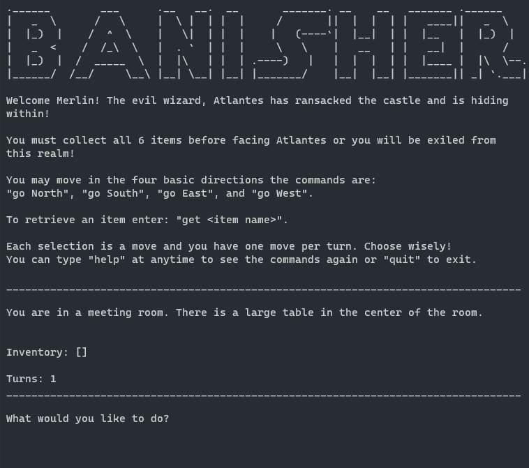

# The Rusty Wizard

  

## *A text-based game written in Rust.*

The goal behind this project was to learn and understand the concepts of the Rust programming language.  
This is the first program I have written in Rust besides their introductory [grrs tutorial](https://rust-cli.github.io/book/tutorial/impl-draft.html).  

The *Rusty Wizard* is a port of one of my other projects, *Banisher*, which was a final project for an Intro to Python class I took  
while pursuing my Bachelors in Cybersecurity.

I felt like I could lessen the learning curve by transferring an existing project, and this was a fun learning experience.  While more verbose, this project has made me a novice [*Rustacean*](https://www.rustaceans.org/), and I can't wait to expand beyond the command line and learn more about Rust's WebAssembly and Networking applications.  

## Screenshot

## License

This project is licensed under the [MIT License](./LICENSE).
